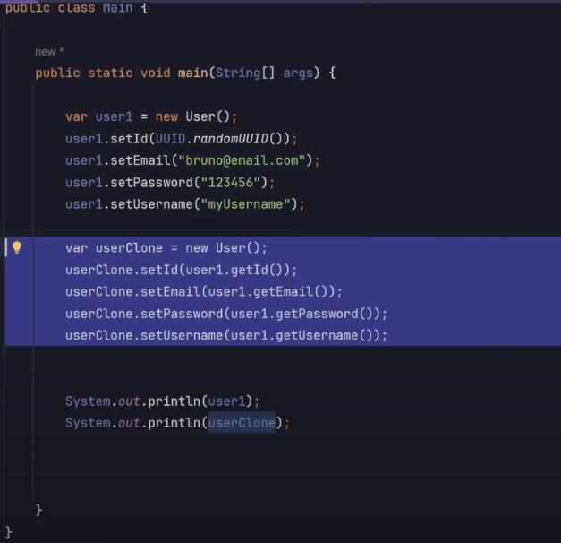
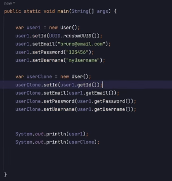
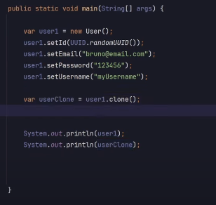

# About

Brief study about Design Pattern Prototype with Java.

[Refactoring Guru](https://refactoring.guru/pt-br/design-patterns/prototype/java/example)

In this code, we are trying to clone the User class. ⬇️



With this method, the clone method is tightly coupled (acoplado) to the User class. That means that if the User class
creates an extra attribute, we'll need to get to every clone method and make the changes (adding the extra attribute).

That's not interesting, imagine going to every clone to make changes everytime we add some attribute to a class?

**❗Important: when we clone the class, the clone itself will have a new hashcode, it's a whole new instance**.

If we update the first object (that has been cloned), the clone will not be changed.

# So, how to fix this?

Firstly, we are going to create an Interface called Prototype.

The method will return the interface (Prototype) and will be called "clone()".

So, everytime that we implement this interface and use the clone method, all the implementation will be inside the class,
and not exposed.

```java
public interface Prototype {
    Prototype clone();
}
```

# Using the interface in the class

Since we already created the interface and the method, we are going to the class that wants to use the Prototype and
implement it.

```java
public class User implements Prototype {}
```

And now, we can implement the methods from the interface (clone method).

```java
public class User implements Prototype {
    //attributes
    
    //constructors
    
    //getter and setters
    
    @Override
    public Prototype clone() {
        
    }
}
```

We need to create a custom constructor. He's going to receive the class itself, allowing to clone this object.

It can be public or private.

Another interest thing is that we can access the class attributes (even with them being private), without the need to 
use getters and setters.

So, if we wanted to, we could erase all the setters fields.

Now, we can return a ``new User()`` inside the interface method, using ``this`` (the class User itself) as a parameter.

```java
public class User implements Prototype {
    
    //attributes

    private User(User user) {
        this.id = user.id;
        this.email = user.email;
        this.username = user.username;
        this.password = user.password;

        
    }
    
    //getters and setters

    @Override
    public Prototype clone() {
        //we use this, using the class itself as a parameter
        return new User(this);
    }
}
```

# Using the method

## Before



## After



Now, if by any chance the User class gets another attribute, we just need to go inside the custom constructor and add it.

```java
public User(User user) {
    this.id = user.id;
    this.email = user.email;
    this.username = user.username;
    this.password = user.password;
    //new attribute
}
```


 
# Disadvantage of prototype

Imagine if the class we want to clone (User), has a dependency in another class and this class depends on User as well.

In this case, when we use the prototype pattern, it'll become a loop, and he will not be able to conclude.
